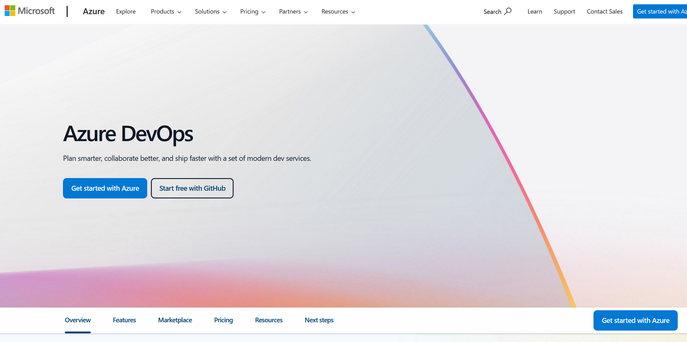
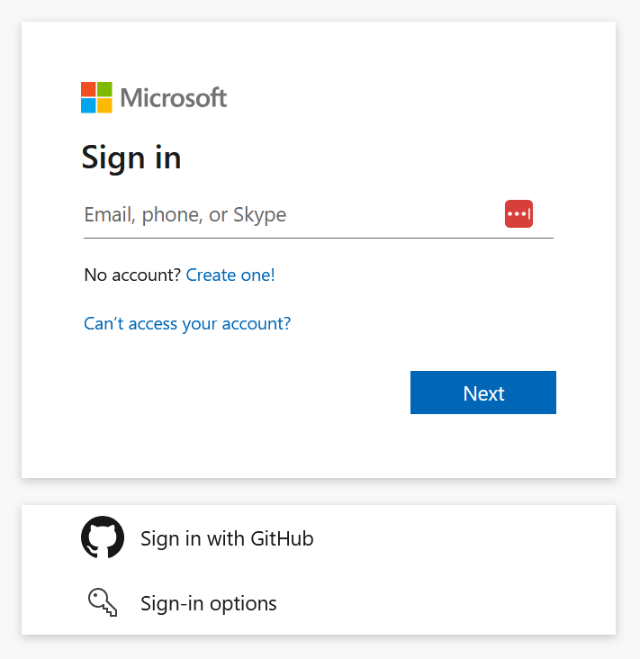
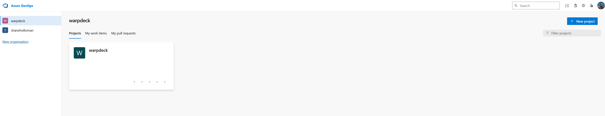

# Delivering Markdown Moose to VSCode Marketplace

This document outlines the process for publishing Markdown Moose to the Visual Studio Code Marketplace.

## Prerequisites

1. Node.js and npm installed
2. A free Azure DevOps account
3. Your extension code ready for release
4. A GitHub repository (already set up at <https://github.com/shaneholloman/markdown-moose>)

## One-time Setup

1. Install vsce (VS Code Extension Manager):

    ```sh
    npm install -g @vscode/vsce
    ```

2. Get Personal Access Token (PAT):

    - Visit <https://dev.azure.com>
    - Sign in (create account if needed, can use GitHub account)
    - Click profile icon → ... → User Settings → Personal access tokens
    - Create new token:
        - Name: VSCode Marketplace
        - Organization: All accessible organizations
        - Expiration: 1 year
        - Scopes: Select "Custom defined"
            1. Click "Show all scopes" at bottom
            2. Expand "Marketplace"
            3. Check ALL of these boxes:
                - Acquire
                - Manage
                - Publish
            4. Expand "User Profile"
                - Check "Read" permission
    - Copy and save token securely (you can't view it again later)

    

    

    

3. Login with publisher name:

    ```sh
    vsce login shaneholloman
    # Enter PAT when prompted
    ```

## Publishing Process

1. Update version in package.json:

    ```json
    {
        "version": "x.x.x"
    }
    ```

2. Package extension:

    ```sh
    vsce package
    ```

    This creates: markdown-moose-x.x.x.vsix

3. Test packaged extension:

    - Open VSCode
    - Ctrl+Shift+P → "Install from VSIX"
    - Select the .vsix file
    - Verify all features work

4. Publish to marketplace:

    ```sh
    vsce publish
    ```

## Post-Publishing

Your extension will be available at:
<https://marketplace.visualstudio.com/items?itemName=shaneholloman.markdown-moose>

Users can install it:

1. Directly in VSCode: Extensions tab → Search "Markdown Moose"
2. Web: Visit marketplace link → Click Install

## Publishing Updates

1. Update version in package.json
2. Test thoroughly
3. Run `vsce publish`

## Maintenance

- Keep PAT secure
- Renew PAT before expiration
- Monitor GitHub issues
- Update extension when needed
- Respond to marketplace reviews

## Notes

- Publishing is free
- Marketplace hosting is free
- Users get automatic updates
- Installation stats available
- Standard distribution method used by most VSCode extensions

## Troubleshooting

If `vsce publish` fails:

1. Verify PAT is valid
2. Check package.json is valid
3. Ensure all required fields exist:
    - name
    - displayName
    - description
    - version
    - publisher
    - repository
    - icon
